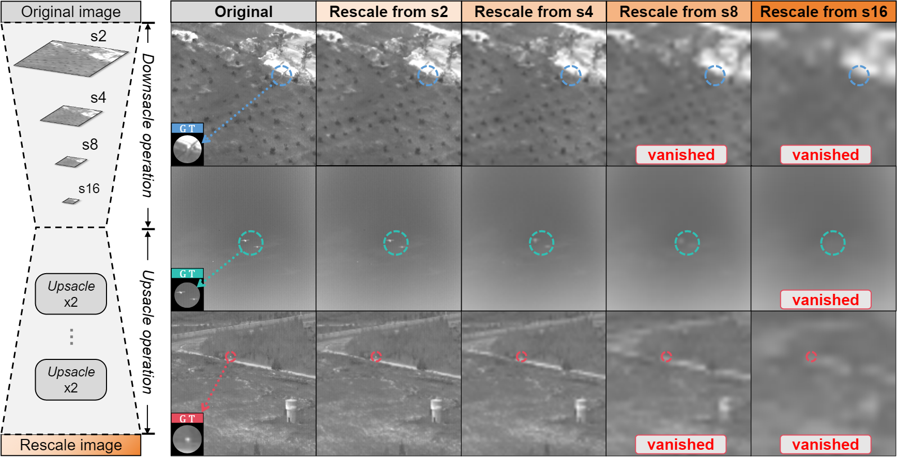
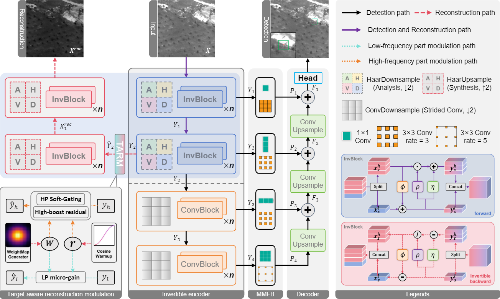
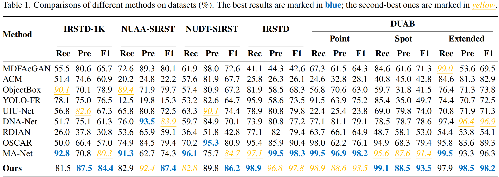
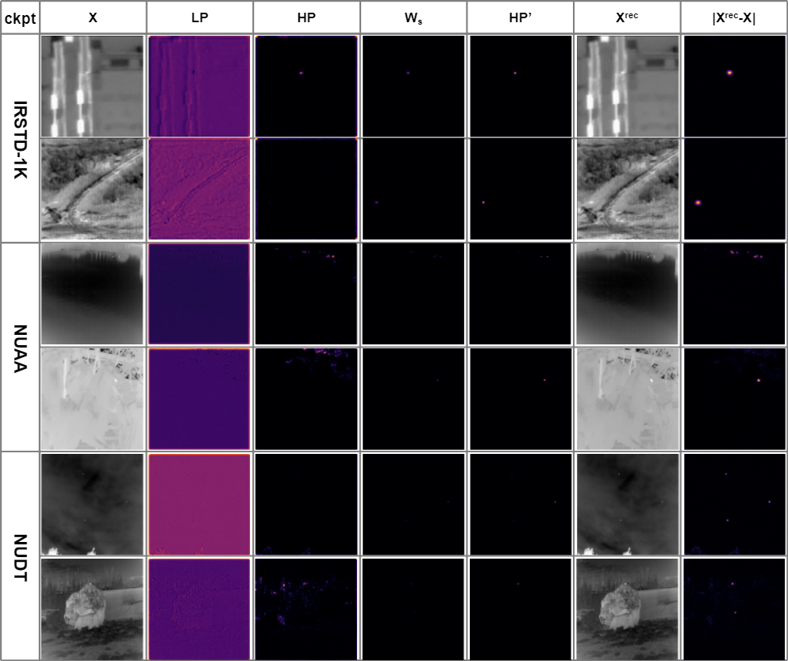

# InvDet
Target-Aware Invertible Encoder with Reconstruction Guidance for Infrared Small Target Detection []([https://你的论文真实链接_比如arxiv地址](https://github.com/SchulerYan/InvDet/blob/main/paper/InvDet_CVPR2026.pdf))

> **⏳ Status Update:** Welcome to the official repository for **InvDet**. The source code (based on PyTorch) is currently undergoing institutional review and final refinement for extended work. The full training and inference pipelines will be open-sourced here as soon as the process is complete. 

## Overview

Modern detectors typically deepen backbones and rely on aggressive downsampling to harvest high-level semantics. But this severely degrades low-energy infrared tiny targets via rescale-induced information loss. This work introduces InvDet, a target-aware invertible encoder that unifies information preservation and target-aware enhancement within a reconstruction-guided detection framework. An invertible pathway reconstructs the input from feature latents, exposing information loss as an optimizable quantity. To decouple detection from irrelevant reconstruction, a Target-Aware Reconstruction Modulation (TARM) module operates only in the inverse path, gating high-pass latents and applying a mild gain to low-pass features without altering the forward detection distribution. In addition, a Geometry–Content Tolerance Metric (GCTM) is proposed to focus on truly informative regions and yields a pixel-wise weight map that gently regularizes the reconstruction branch. Our method achieves competitive accuracy on five public infrared benchmarks while exhibiting strong cross-dataset generalization, providing a principled pathway toward detection-friendly representation learning for scale-challenged visual regimes.



This repository implements **InvDet**, a target-aware invertible encoder that unifies information preservation and target-aware enhancement within a reconstruction-guided detection framework. 



### Key Highlights
* **Invertible Encoder:** Exposes information loss as an optimizable quantity by reconstructing the input from feature latents.
* **TARM Module:** The Target-Aware Reconstruction Modulation (TARM) operates in the inverse path, gating high-pass latents without altering the forward detection distribution.
* **GCTM Metric:** A Geometry-Content Tolerance Metric yields a pixel-wise weight map that gently regularizes the reconstruction branch.

## Performance

Our method achieves competitive accuracy on five public infrared benchmarks (IRSTD-1K, NUAA-SIRST, NUDT-SIRST, IRSTD, and DUAB) while exhibiting strong cross-dataset generalization. 




## Citation

If you find our work helpful for your research, please consider citing our paper:

```bibtex
@inproceedings{yan2026invdet,
  title={Target-Aware Invertible Encoder with Reconstruction Guidance for Infrared Small Target Detection},
  author={Yan, Shule and Zhang, Zetian and Ma, Xiao and Ji, Zexuan},
  booktitle={Proceedings of the IEEE/CVF Conference on Computer Vision and Pattern Recognition (CVPR)},
  year={2026}
}
```

For any inquiries regarding the paper or the upcoming code release, please open an issue or contact yan_shule@njust.edu.cn.
